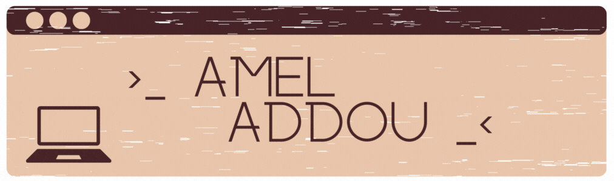

<h2 align="left">Salut 👋!</h2>

###

 

  
  

    
Bienvenu sur mon profil !! Moi c'est Amel,

    
je suis actuellement étudiante en 5ème année d'école d'ingénieure

    
en informatique et gestion à l'école Polytech Montpellier

    
et je suis passionnée de développement web et mobile :).

  

 

###

 

  
  

###
 

  
  

###

<a href="https://skillicons.dev">
  <h3 align="center">Langage de programmation</h3>
        

  
        

    <h3 align="center">Frameworks et bibliothèque</h3>
      

  
      

    <h3 align="center">Bases de données</h3>
    

  
    

  <h3 align="center">Outils et environnement de Développement</h3>
  

  
  
  

</a>

 

###

